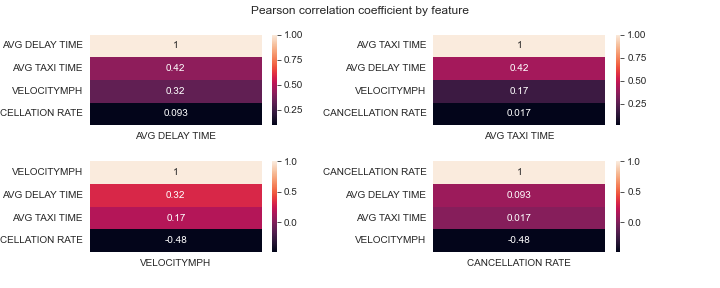
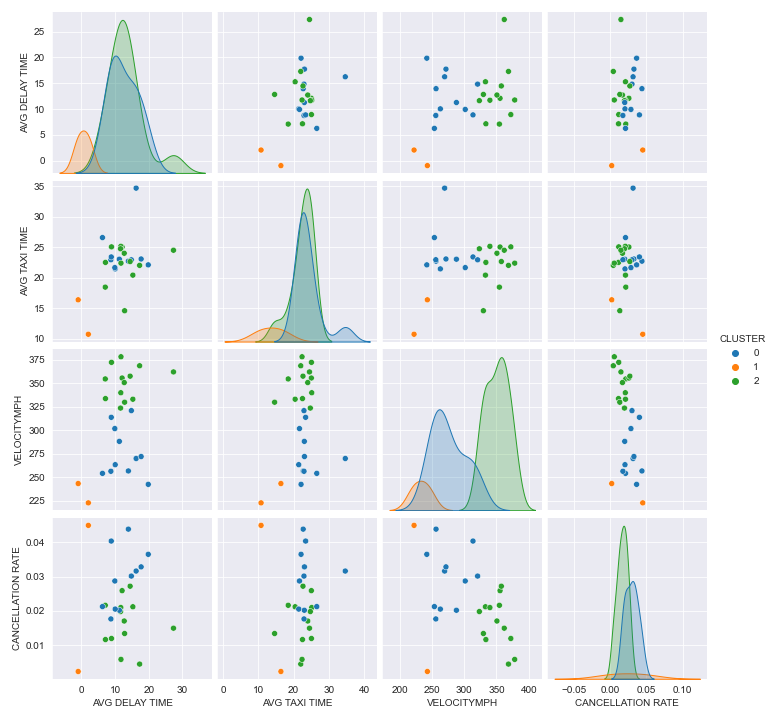
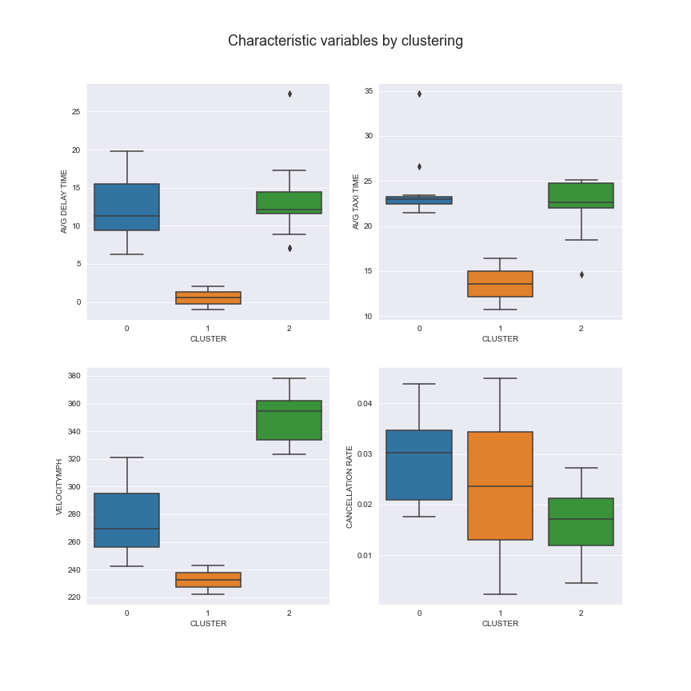

# Clustering Flights

Grouping of airlines by multiple flight characteristics

## Pearson correlation coefficient

## Number of clusters (K) in data set
### Elbow Method

## Plotting features in pairs

## Groups formed for each variable

